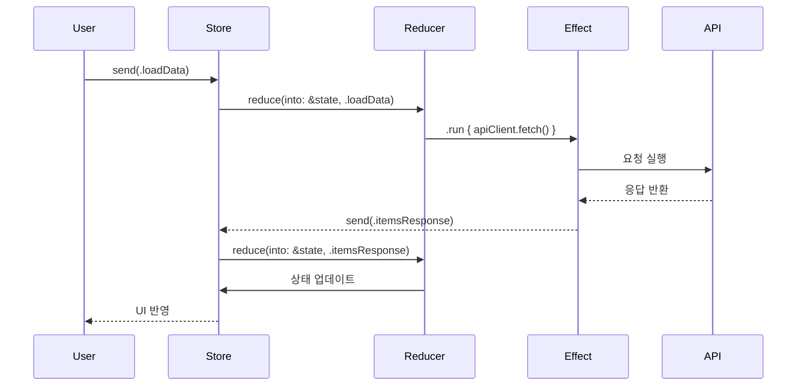

# Chapter 5. Effects

## Effect란?
- Reducer는 순수해야 하지만, 앱은 반드시 외부 세계와 상호작용해야 함.
- Effect = 외부 세계와 상호작용하는 모든 비동기 작업을 캡슐화한 타입.
- Reducer는 State를 변경하고, 동시에 Effect를 반환 → Store가 Effect를 실행하고, 결과 Action을 다시 Reducer로 보냄.

## Effect의 기본 구조
```swift
func reduce(into state: inout State, action: Action) -> Effect<Action> {
  switch action {
  case .buttonTapped:
    // 상태 변경
    state.isLoading = true
    // 부수효과 실행 (예: 네트워크 요청)
    return .run { send in
      let response = try await apiClient.fetchData()
      await send(.responseReceived(response))
    }
  case let .responseReceived(data):
    state.isLoading = false
    state.data = data
    return .none
  }
}
```
- .run 블록 안에서 async/await를 사용 → Action을 다시 send해서 Reducer로 되돌림.
- .none: Effect가 없는 경우

## 다양한 Effect API

메서드 | 설명
---|---
.none | 아무 효과 없음
.send(action) | 즉시 action 반환
.run { send in } | async/await 기반 실행(네트워크, Timer 등)
.task { ... } | Swift Concurrency Task 기반 실행
.merge | 여러 Effect를 동시에 실행
.concatenate | 순차적으로 Effect 실행
.cancel(id: ) | 지정된 Effect 취소
.cancellable(id: ) | Effect를 취소 가능하게 등록

## Cancellation (취소)
- 긴 작업(네트워크, Timer)은 필요할 때 취소할 수 있어야 함.
- .cancellable(id:) 와 .cancel(id:) 조합을 사용:
```swift
enum CancelID { case timer }

case .startTimer:
  return .run { send in
    for await _ in clock.timer(interval: .seconds(1)) {
      await send(.tick)
    }
  }
  .cancellable(id: CancelID.timer)

case .stopTimer:
  return .cancel(id: CancelID.timer)
```

## Dependencies와 결합
- 최신 TCA에서는 Environment 대신 @Dependency를 사용해 Effect 내부에서 외부 의존성을 주입받음:
```swift
@Dependency(\.apiClient) var apiClient

case .loadData:
  return .run { send in
    let items = try await apiClient.fetchItems()
    await send(.itemsResponse(items))
  }
```

## Effect 동작 흐름 (Mermaid 다이어그램)


## 꼬리 질문 & 답변 예시
- ❓ Reducer 안에서 직접 네트워크 호출하지 말라는 이유는?
  - 간단 답변: Reducer는 순수 함수여야 하므로.
  - 심화 답변: 네트워크 호출은 외부 세계와의 상호작용으로 테스트하기 어렵습니다. Effect로 분리하면 Mock 주입과 테스트가 가능해집니다.

- ❓ Cancellation이 중요한 이유는?
  - 간단 답변: 불필요한 네트워크 요청이나 Timer가 계속 실행되는 걸 막기 위해.
  - 심화 답변: 사용자가 화면을 떠나거나 조건이 바뀌면, 오래 실행되는 작업은 반드시 취소되어야 리소스 누수를 방지하고 UI와 상태가 일관되게 유지됩니다.

- ❓ .run과 .task의 차이는?
  - .run: Effect builder로 send를 통해 Action을 여러 번 방출할 수 있음 (ex: Timer loop).
  - .task: 단일 비동기 작업을 실행하고 하나의 Action만 반환할 때 적합.

## Chapter 5 요약
- Effect = Reducer에서 분리된 모든 부수효과
- async/await 기반 API (.run, .task)로 비동기 처리가 단순해짐
- 취소(Cancellation)는 실무에서 매우 중요
- 의존성은 @Dependency를 통해 주입
- Reducer는 순수성을 유지하고, Effect는 외부 세계와의 상호작용 담당

## 내용 참고
- https://axiomatic-fuschia-666.notion.site/Chapter-3-TCA-2-c56b24efb2154dad9ed8e54139247024