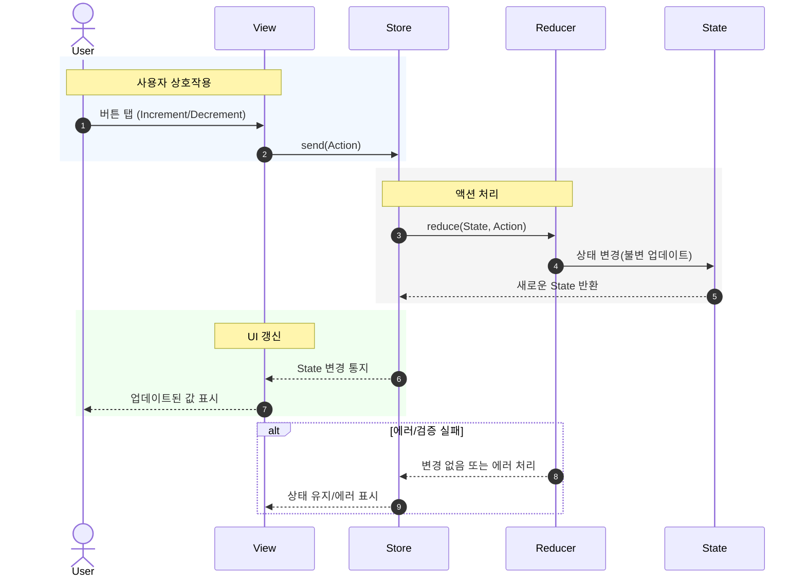

# Chapter 2. State & Actions

## State (상태)
- State = 앱의 진실의 원천(single source of truth)
- UI에 표현되거나 비즈니스 로직에서 필요한 모든 데이터가 State 안에 담깁니다.
- Swift의 struct 로 정의 → 불변성과 값 타입의 장점을 활용.

```swift
struct CounterState: Equatable {
    var count = 0
}
```

- Equatable 을 채택하는 이유:
  - View와 바인딩할 때 변경 감지 가능
  - 테스트에서 기대값 비교 가능

## Action (액션)
- Action = 상태를 변화시키는 모든 사건(event)
- 사용자의 인터랙션, 네트워크 응답, 타이머 이벤트 등 전부 Action으로 표현합니다.
- Swift의 enum 으로 정의 → 분기 처리가 쉽고, 새로운 이벤트를 추가하기 용이합니다.

```swift
enum CounterAction: Equatable {
    case increment
    case decrement
}
```

- 역시 Equatable 채택 → 테스트에서 두 액션이 같은지 쉽게 비교 가능.

## State & Action in practice (Counter 예제)
```swift
struct CounterState: Equatable {
    var count = 0
}

enum CounterAction: Equatable {
    case increment
    case decrement
}
```

- UI에서 버튼을 누르는 행위:
  - + 버튼 → .increment 액션 발생
  - - 버튼 → .decrement 액션 발생
- 이 액션은 Reducer로 전달되어 count 상태를 변화시킴.

## 왜 이렇게 나누는가?
- 상태(State)와 이벤트(Action)를 명확히 구분하면:
	1.	예측 가능성: 어떤 액션이 들어왔을 때 상태가 어떻게 변하는지 한눈에 확인 가능
	2.	테스트 용이성: 액션을 주입 → 기대 상태가 맞는지 검증
	3.	확장성: 액션 enum에 새 case 추가만으로 기능 확장 가능

## 코드 흐름 (Mermaid 시퀀스)


## Chapter 2 요약
- State = 앱의 데이터 (struct + Equatable)
- Action = 상태를 변화시키는 이벤트 (enum + Equatable)
- State와 Action을 분리하면 → 예측 가능성, 테스트 용이성, 확장성 확보
- 다음 챕터에서 Reducer를 통해 State와 Action을 묶는 방법을 다룸


## 꼬리 질문 & 답변 예시
### ❓ State를 struct로 정의하는 이유는?
- 간단 답변: 값 타입이라 참조 사이드 이펙트가 없고, 복사/비교가 쉬움.
- 심화 답변: SwiftUI와 잘 맞물림 (Equatable 기반 비교). Immutable-like 패턴이 가능해 테스트와 리팩토링에 유리함.

### ❓ Action을 enum으로 정의하는 이유는?
- 간단 답변: 열거형은 새로운 이벤트 추가/분기 처리가 간결하기 때문.
- 심화 답변: exhaustive switch를 강제해 빠뜨린 이벤트 없이 모든 상황을 처리 가능. 이는 안정성과 유지보수성에 기여.

### ❓ State와 Action을 분리하지 않고 ViewModel 내부에서 처리하면 어떤 문제가 있나요?
- 간단 답변: 상태와 이벤트가 섞여서 테스트와 추적이 어려워짐.
- 심화 답변: ViewModel이 비대해지고, 이벤트 처리 로직이 UI와 강하게 결합. 결과적으로 재사용성과 모듈성이 떨어짐.

### ❓ Action은 반드시 Equatable해야 하나요?
- 간단 답변: 대부분은 Equatable이면 좋지만, 필수는 아님.
- 심화 답변: TestStore 검증을 위해서는 Equatable이 필요. Equatable하지 않은 데이터(예: 클로저)는 직접 비교 불가하므로 주의가 필요.