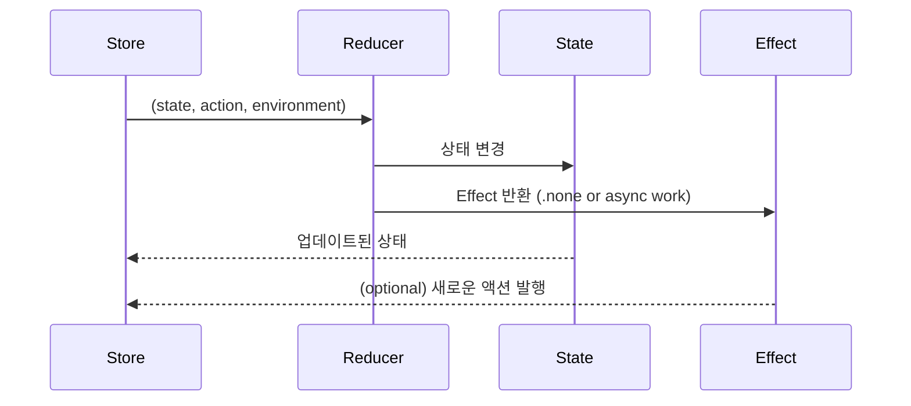

# Chapter 3. Reducers

## Reducer란?
- Reducer = 상태(State)를 액션(Action)에 따라 어떻게 바꿀지 정의하는 함수
- 순수 함수(Pure Function) → 입력과 출력이 항상 동일해야 함
- TCA에서는 아래 형태로 정의됩니다:
```swift
Reducer<State, Action, Environment>
```
- Input: 현재 State, 들어온 Action, 외부 의존성 Environment
- Output: 변경된 State + 실행할 Effect

## Counter Reducer 예제
```swift
let counterReducer = Reducer<CounterState, CounterAction, CounterEnvironment> { state, action, environment in
    switch action {
    case .increment:
        state.count += 1
        return .none  // 부수효과 없음
    case .decrement:
        state.count -= 1
        return .none
    }
}
```
- .none : 실행할 사이드 이펙트가 없음을 의미
- 즉, 단순히 상태만 바꾸고 끝

## Reducer의 특징
1. 순수 함수 (Pure Function)
  - 같은 State와 Action을 주면 항상 같은 State가 나옴
  - 테스트가 쉬움
2. Side Effect 분리
  - Reducer 내부에서 외부 API 호출 같은 작업을 하지 않음
  - 대신 Effect 타입으로 반환해 비동기/외부 작업을 나중에 실행
3. 조합 가능성 (Composability)
  - 작은 Reducer들을 결합해 큰 Reducer를 만들 수 있음
  - → 6장에서 더 자세히 다룸

## Reducer 동작 흐름 (Mermaid 다이어그램)


## Reducer 확장 예시: 랜덤 숫자 액션 추가
```swift
enum CounterAction: Equatable {
    case increment
    case decrement
    case randomButtonTapped
    case randomResponse(Int)
}

struct CounterEnvironment {
    var generateRandom: () -> Int
}

let counterReducer = Reducer<CounterState, CounterAction, CounterEnvironment> { state, action, env in
    switch action {
    case .increment:
        state.count += 1
        return .none

    case .decrement:
        state.count -= 1
        return .none

    case .randomButtonTapped:
        let value = env.generateRandom()
        return Effect(value: .randomResponse(value))  // Effect 반환

    case let .randomResponse(value):
        state.count = value
        return .none
    }
}
```

- Environment에서 랜덤 숫자 생성기를 주입받음
- Reducer는 순수 함수를 유지하면서도, Effect를 통해 사이드 이펙트 분리

## 꼬리 질문 & 답변 예시
### ❓ Reducer는 왜 순수 함수여야 하나요?
- 간단 답변: 테스트하기 쉽고, 예측 가능성을 유지하기 위해.
- 심화 답변: 외부 IO(네트워크, DB)에 의존하지 않기 때문에 State 변화가 항상 동일. 이는 디버깅과 리팩토링을 안전하게 만들어줌.

### ❓ Reducer 안에서 네트워크 호출을 직접 해도 되나요?
- 간단 답변: 안 됩니다.
- 심화 답변: Reducer는 상태 변화만 담당해야 합니다. 네트워크 호출은 Effect로 분리해야 테스트 가능성과 일관성이 유지됩니다.

### ❓ 여러 Reducer를 어떻게 합치나요?
- 간단 답변: combine 이나 pullback을 이용해 작은 Reducer들을 합칩니다.
- 심화 답변: 이렇게 하면 Feature 단위로 나눈 Reducer를 재사용하고, 대규모 앱을 계층적으로 구성할 수 있습니다. (6장에서 자세히 다룸)

### ❓ Reducer에서 Environment가 필요한 이유는?
- 간단 답변: 외부 의존성을 주입하기 위해.
- 심화 답변: API 클라이언트, DB, Timer, Random Generator 등 외부 세계에 의존하는 기능을 Environment로 주입 → 테스트에서는 Mock으로 교체 가능.