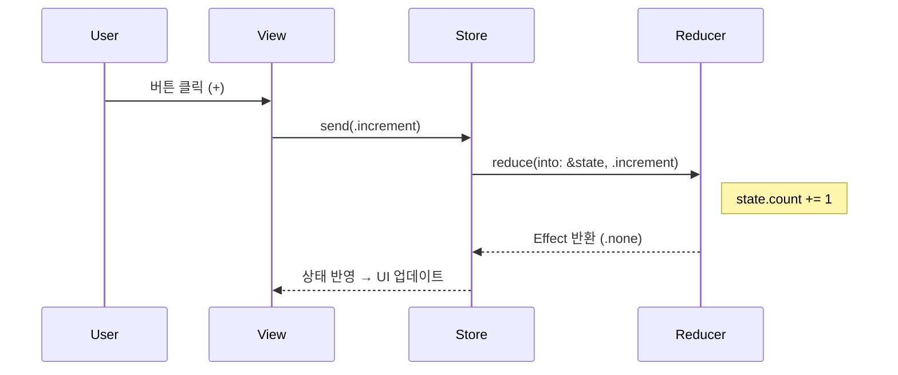

# Chapter 4. The Store

## Store란?
- Store = State와 Reducer, Effect를 관리하는 컨테이너
- View는 Store로부터 상태를 구독하고, 액션을 보내 상태를 변화시킴.
- TCA의 중심 객체이자 SwiftUI와 Reducer를 연결하는 브릿지 역할.

## Store의 정의
>Store는 제네릭 타입으로 정의됩니다.
```swift
Store<State, Action>
```
- State: 현재 앱 상태
- Action: 상태를 변경할 이벤트
- Reducer는 Store에 연결되어 State와 Action을 이어줌.

## SwiftUI와의 연결
```swift
struct CounterView: View {
  let store: StoreOf<CounterFeature>

  var body: some View {
    WithViewStore(self.store, observe: { $0 }) { viewStore in
      VStack {
        Text("\(viewStore.count)")
        HStack {
          Button("−") { viewStore.send(.decrement) }
          Button("+") { viewStore.send(.increment) }
        }
      }
    }
  }
}
```
- WithViewStore: Store를 구독하고, State/Action을 View에 바인딩하는 도우미.
- viewStore.state: 현재 상태 값
- viewStore.send(.action): 액션 전달

### WithViewStore 성능 이슈
- WithViewStore는 내부적으로 모든 State 변화를 감시하기 때문에 View의 재렌더링 빈도가 늘어날 수 있습니다.
- 개선 방안:
  - observe 매개변수를 사용해 필요한 속성만 구독하기
  - 예시: (어 이거? ReactorKit에서도 State 뭉떵이로 줘서 발생하던거랑 같은데??)
```swift
WithViewStore(self.store, observe: \.count) { viewStore in
  Text("\(viewStore.state)")
}
```
- 또는 ViewStore(store, observe: …)를 뷰에 직접 주입해, 더 fine-grained 하게 제어

- 최신 TCA에서는 **BindableState + BindingViewStore**를 활용하는 것이 권장됩니다.
- SwiftUI의 @Binding과 자연스럽게 연결되고, 불필요한 렌더링을 줄일 수 있음.


## Store 초기화
- Store는 보통 앱 엔트리 포인트(App struct)에서 생성합니다.
```swift
@main
struct MyApp: App {
  var body: some Scene {
    WindowGroup {
      CounterView(
        store: Store(
          initialState: CounterFeature.State(),
          reducer: CounterFeature()
        )
      )
    }
  }
}
```

## Store가 Thread-Safe 하지 않은 이유
- TCA의 Store는 메인 스레드 전용으로 설계됨.
- 이유:
    1. SwiftUI 자체가 메인 스레드에서만 안전하게 동작
    2. 상태 변경과 View 업데이트가 항상 일관된 순서로 처리되어야 함
- 그래서 Store 내부에서는 메인 액터를 강제합니다.
  - → 비동기 작업은 Effect에서 background에서 수행 → 완료 후 Store로 돌아올 때는 다시 메인 스레드로 전환.
- Point-Free의 공식 문서 강조:
  - Store를 멀티스레드에서 동시에 접근하는 건 안전하지 않으며, Reducer 호출과 State 변환은 항상 메인 스레드에서 이뤄져야 함.
- 그래서!?
  - View로써의 TCA를 사용하고, 의존성을 주입하는 `Remote/Local Data를 Actor로 구현`하는 방향으로 작업 중
  - async await + actor로 쓰레드 순서 보장이 될테고, Apple에서 미뤄주고 있으니까

## 최신 버전 기준 보완 사항
- Store 타입은 보통 StoreOf<Feature> 형태로 사용합니다.
  - StoreOf<CounterFeature> 는 Store<CounterFeature.State, CounterFeature.Action>의 typealias.
- WithViewStore는 간단하지만, 최신 TCA에서는 ViewStore를 직접 주입하거나 SwiftUI의 BindableState / BindableAction를 활용한 BindingViewStore를 더 권장하는 경우가 많습니다.
- Store는 가능한 Feature 단위로만 전달하고, 전역 Store 공유는 지양합니다.
- Navigation/Sheet/Alert 같은 상태는 Store에 보관하고, SwiftUI와 동기화하는 패턴(@PresentationState)이 최신 권장 방식입니다.

## Store 동작 흐름 (Mermaid 다이어그램)


## 꼬리 질문 & 답변 예시
### ❓ Store와 ViewStore의 차이는?
- 간단 답변: Store는 Reducer와 상태를 관리하는 컨테이너, ViewStore는 View가 Store를 쉽게 구독/액션 전송할 수 있도록 만든 래퍼.
- 심화 답변: Store는 직접 사용하기엔 제네릭이 복잡하고 Equatable 비교나 Binding 지원이 부족합니다. ViewStore/WithViewStore는 이를 보완해 UI에 적합한 API를 제공합니다.

### ❓ Store를 전역(Global)으로 공유하면 어떤 문제가 있나요?
- 간단 답변: 전역 상태 공유는 테스트성과 모듈성을 깨뜨립니다.
- 심화 답변: 전역 Store는 단일 거대한 Reducer에 의존하게 되고, Feature 간 결합도가 높아져서 재사용성과 유지보수성이 떨어집니다. Feature 단위로 스코프를 줄이는 것이 권장됩니다.

### ❓ StoreOf 문법이 왜 생겼나요?
- 간단 답변: 제네릭을 간단히 쓰기 위해.
- 심화 답변: Store<Feature.State, Feature.Action>을 매번 작성하는 것은 장황합니다. StoreOf<Feature>는 타입 안정성과 가독성을 동시에 확보하는 typealias입니다.

## Chapter 4 요약
- Store = Reducer와 State, Effect를 관리하는 컨테이너
- View는 Store를 구독하고, Action을 보내 상태를 변경
- 최신 버전에서는 StoreOf<Feature> 사용, @PresentationState 등을 통해 SwiftUI와 더 강력하게 통합
- Store는 전역 공유 대신 Feature 단위로 스코프를 관리하는 것이 핵심